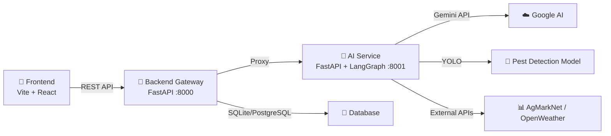
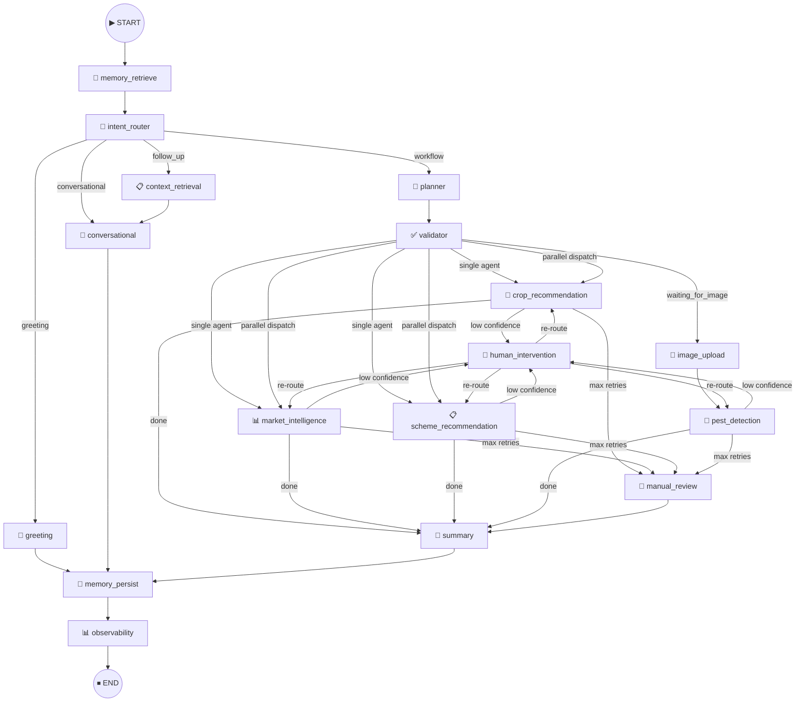

<p align="center">
  
</p>

<h1 align="center">FasalSaathi 🌾</h1>

<p align="center">
  <strong>AI-Powered Agricultural Advisory Platform for Indian Farmers</strong><br/>
  LangGraph multi-agent orchestration • Pest detection • Crop advisory • Government schemes • Market intelligence
</p>

<p align="center">
  
  
  
  
  
  
</p>

---

## 🏗️ Architecture

FasalSaathi is a **three-tier** platform containing a React frontend, a FastAPI backend gateway, and a LangGraph-powered AI service.



### Component Roles

```
┌──────────────────────────────────────────────────────────────────┐
│                    🌐  React + Vite  (:5173)                     │
│          Zustand state · React Router · Tailwind CSS             │
│   Dashboard · AI Chat · Crop Suggestions · Market · Schemes     │
└───────────────────────────┬──────────────────────────────────────┘
                            │ REST / multipart
┌───────────────────────────▼──────────────────────────────────────┐
│                ⚡  FastAPI Backend Gateway  (:8000)               │
│  Auth (JWT) · User CRUD · Profile Enrichment · Proxy Layer      │
│  ┌───────────────────────────────────────────────────────────┐   │
│  │ /auth  /users  /crops  /weather  /chat  /detect  /agents │   │
│  └───────────────────────────────────────────────────────────┘   │
└───────────────────────────┬──────────────────────────────────────┘
                            │ httpx (authenticated proxy)
┌───────────────────────────▼──────────────────────────────────────┐
│              🤖  AI Service — LangGraph Engine  (:8001)          │
│                                                                   │
│  ┌────────────────────────────────────────────────────────────┐  │
│  │         Unified LangGraph StateGraph (17 nodes)            │  │
│  │                                                            │  │
│  │  memory_retrieve → intent_router → planner → validator     │  │
│  │       ↓ dispatch via Send() + conditional edges            │  │
│  │  ┌──────────┐ ┌──────────┐ ┌──────────┐ ┌──────────────┐  │  │
│  │  │  Crop    │ │  Market  │ │  Scheme  │ │    Pest      │  │  │
│  │  │  Agent   │ │  Agent   │ │  Agent   │ │  Detection   │  │  │
│  │  └──────────┘ └──────────┘ └──────────┘ └──────────────┘  │  │
│  │       ↓ confidence gating                                  │  │
│  │  human_intervention → summary → memory_persist → END      │  │
│  │  (manual_review fallback option)                           │  │
│  │  image_upload interrupt fallback for photo scans           │  │
│  └────────────────────────────────────────────────────────────┘  │
│                                                                   │
│  AsyncSqliteSaver checkpoints · Rate-limited Gemini calls        │
└───────────────────────────┬──────────────────────────────────────┘
                            │
              ┌─────────────┼─────────────┐
              ▼             ▼             ▼
         🧠 Gemini      🗄️ SQLite      📸 YOLO .pt
         (LLM API)    (Users/Memory)  (Trained model)
```

---

## 🧠 LangGraph Orchestration Pipeline

The AI service utilizes a **unified LangGraph `StateGraph`** with **17 nodes** and **conditional routing** (replacing hardcoded chains and supervisors). The graph dynamically determines agent activation, execution ordering, and human review steps.

### Graph Topology



### The 17 Graph Nodes

| # | Node | Source File | Purpose |
|---|---|---|---|
| 1 | `memory_retrieve` | [memory_node.py](file:///e:/Desktop/Web%20Development/FasalSaathi/ai_service/app/nodes/memory_node.py) | Loads past conversation context from SQLite memory store |
| 2 | `intent_router` | [intent_router.py](file:///e:/Desktop/Web%20Development/FasalSaathi/ai_service/app/graph/intent_router.py) | Classifies intent via regex fast-path + Gemini LLM fallback |
| 3 | `greeting` | [conversational.py](file:///e:/Desktop/Web%20Development/FasalSaathi/ai_service/app/nodes/conversational.py) | Handles greetings/thanks (zero LLM API calls) |
| 4 | `conversational` | [conversational.py](file:///e:/Desktop/Web%20Development/FasalSaathi/ai_service/app/nodes/conversational.py) | Free-form agricultural Q&A using Gemini |
| 5 | `context_retrieval` | [context_retrieval.py](file:///e:/Desktop/Web%20Development/FasalSaathi/ai_service/app/nodes/context_retrieval.py) | Pulls prior results for follow-up questions |
| 6 | `planner` | [planner.py](file:///e:/Desktop/Web%20Development/FasalSaathi/ai_service/app/graph/planner.py) | LLM plans agent execution and parameters |
| 7 | `validator` | [validator.py](file:///e:/Desktop/Web%20Development/FasalSaathi/ai_service/app/graph/validator.py) | Validates plans, computes graph_score, builds execution groups |
| 8 | `crop_recommendation` | [crop_recommendation.py](file:///e:/Desktop/Web%20Development/FasalSaathi/ai_service/app/nodes/crop_recommendation.py) | Invokes crop recommendation agent |
| 9 | `market_intelligence` | [market_intelligence.py](file:///e:/Desktop/Web%20Development/FasalSaathi/ai_service/app/nodes/market_intelligence.py) | Invokes market analysis agent |
| 10 | `scheme_recommendation` | [scheme_recommendation.py](file:///e:/Desktop/Web%20Development/FasalSaathi/ai_service/app/nodes/scheme_recommendation.py) | Invokes government scheme agent |
| 11 | `pest_detection` | [pest_detection.py](file:///e:/Desktop/Web%20Development/FasalSaathi/ai_service/app/nodes/pest_detection.py) | Runs YOLOv8-based pest/disease detection on crop leaf images |
| 12 | `image_upload` | [image_upload.py](file:///e:/Desktop/Web%20Development/FasalSaathi/ai_service/app/nodes/image_upload.py) | Handles image upload interrupt (LangGraph `interrupt` state) |
| 13 | `human_intervention` | [human_intervention.py](file:///e:/Desktop/Web%20Development/FasalSaathi/ai_service/app/nodes/human_intervention.py) | Requests human input when agent confidence scores are low |
| 14 | `manual_review` | [manual_review.py](file:///e:/Desktop/Web%20Development/FasalSaathi/ai_service/app/nodes/manual_review.py) | Fallback when intervention attempts are exhausted |
| 15 | `summary` | [summary_node.py](file:///e:/Desktop/Web%20Development/FasalSaathi/ai_service/app/nodes/summary_node.py) | Synthesizes agent data into clean, farmer-friendly responses |
| 16 | `memory_persist` | [memory_node.py](file:///e:/Desktop/Web%20Development/FasalSaathi/ai_service/app/nodes/memory_node.py) | Persists conversation state/history back to the SQLite memory store |
| 17 | `observability` | [observability.py](file:///e:/Desktop/Web%20Development/FasalSaathi/ai_service/app/nodes/observability.py) | Logs execution trace, graph path, and timing metrics |

### Graph State Schema (`FasalSaathiState`)

The state is managed using a `TypedDict` in [state.py](file:///e:/Desktop/Web%20Development/FasalSaathi/ai_service/app/graph/state.py) that acts as the single source of truth:

```python
class FasalSaathiState(TypedDict):
    messages: Annotated[list[AnyMessage], add_messages]
    farmer_profile: dict
    intent: str
    sub_intents: list[str]
    intent_confidence: float
    planner_output: dict
    validation_result: dict
    crop_recommendations: Annotated[list[dict], operator.add]
    market_analysis: Annotated[list[dict], operator.add]
    scheme_recommendations: Annotated[list[dict], operator.add]
    pest_detection_result: Annotated[dict, _merge_dicts]
    confidence_scores: Annotated[dict[str, float], _merge_dicts]
    uploaded_image_id: str
    image_metadata: dict
    intervention_attempts: Annotated[dict[str, int], _merge_dicts]
    graph_path: Annotated[list[str], operator.add]
    final_response: str
```

### Routing Logic

Defined in [routing.py](file:///e:/Desktop/Web%20Development/FasalSaathi/ai_service/app/graph/routing.py):

| Function | Trigger | Routes To |
|---|---|---|
| `route_after_intent` | After intent classification | `greeting` · `conversational` · `context_retrieval` · `planner` |
| `route_after_validation` | After plan validation | Single agent · `Send()` parallel dispatch · `image_upload` · `conversational` (fallback) |
| `route_after_agent` | After each agent completes | Next group · `human_intervention` · `manual_review` · `summary` |
| `route_after_intervention` | After human input | Re-entry to agent node · `image_upload` · `summary` |

### Key Design Patterns

*   **Parallel Agent Dispatch**: LangGraph `Send()` commands parallel-dispatches eligible agents.
*   **Confidence Gating**: Agents include confidence ratings. Scores falling below `0.5`–`0.6` trigger a `human_intervention` node.
*   **Loop Prevention**: `intervention_attempts` counter caps human interventions at 2, falling back to `manual_review` to bypass further loops.
*   **Checkpoint Persistence**: `AsyncSqliteSaver` persists state transactions at every node.
*   **Rate Limiting**: `safe_llm_invoke_async` handles rate limits via exponential backoff (enforcing a 10 RPM limit).
*   **Persistent Memory**: SQLite-backed session database supports contextual follow-up retrieval.

---

## 🤖 AI Agents

### Specialist Agents

| Agent | Source File | Tools Used | Purpose |
|---|---|---|---|
| 🌾 **Crop Recommendation** | [crop_recommendation_agent.py](file:///e:/Desktop/Web%20Development/FasalSaathi/ai_service/app/agents/crop_recommendation_agent.py) | Weather Client, Soil Data | Recommends crops based on soil, climate, location, and history |
| 📊 **Market Intelligence** | [market_intelligence_agent.py](file:///e:/Desktop/Web%20Development/FasalSaathi/ai_service/app/agents/market_intelligence_agent.py) | AgMarkNet, Trend Analysis, Price Forecasting | Mandi prices, price forecasting, demand trends |
| 🏛️ **Scheme Recommendation** | [scheme_recommendation_agent.py](file:///e:/Desktop/Web%20Development/FasalSaathi/ai_service/app/agents/scheme_recommendation_agent.py) | Government Scheme DB | Personalised matching with eligible government schemes |
| 🐛 **Pest Detection** | [pest_detection.py](file:///e:/Desktop/Web%20Development/FasalSaathi/ai_service/app/nodes/pest_detection.py) | Trained YOLOv8 Weights | Detects crop pests/diseases from uploads |

### External Tool Integrations

| Tool | Source File | Source API / Data | Purpose |
|---|---|---|---|
| Weather Client | [weather_client.py](file:///e:/Desktop/Web%20Development/FasalSaathi/ai_service/app/tools/weather_client.py) | OpenWeatherMap API | Live weather for location |
| AgMarkNet Client | [agmarknet_client.py](file:///e:/Desktop/Web%20Development/FasalSaathi/ai_service/app/tools/agmarknet_client.py) | Govt Mandi prices | Fetches real-time price sheets |
| Trend Analysis | [trend_analysis.py](file:///e:/Desktop/Web%20Development/FasalSaathi/ai_service/app/tools/trend_analysis.py) | Price History Database | Computes pricing momentum |
| Price Forecasting | [forecasting.py](file:///e:/Desktop/Web%20Development/FasalSaathi/ai_service/app/tools/forecasting.py) | ML Regression Models | Multi-week price forecasts |
| Pest Map | [pest_map.py](file:///e:/Desktop/Web%20Development/FasalSaathi/ai_service/app/tools/pest_map.py) | Knowledge Base | Maps 12-class pest output to remedies |
| Scheme Database | [scheme_db.py](file:///e:/Desktop/Web%20Development/FasalSaathi/ai_service/app/tools/scheme_db.py) | Curated Database | Catalogs 25+ seed government schemes |
| Memory Tools | [memory_tools.py](file:///e:/Desktop/Web%20Development/FasalSaathi/ai_service/app/tools/memory_tools.py) | SQLite Database | Reads/Writes long term memory keys |

### YOLOv8 Pest Detection Model
*   **Classes (12)**: Ants, Bees, Beetles, Caterpillars, Earwigs, Earthworms, Grasshoppers, Moths, Slugs, Snails, Wasps, Weevils.
*   **Metric**: mAP@0.5 = `0.773`
*   **Post-processing**: Detected classes are augmented with severity tiers (🔴 High / 🟡 Medium / 🟢 Low) and treatment actions.

---

## ✨ Frontend Features

The frontend application provides **8 primary features** customized for farmers:

| Route | Page / Feature | Component File | Description |
|---|---|---|---|
| `/` | **Landing Page** | [Home.jsx](file:///e:/Desktop/Web%20Development/FasalSaathi/frontend/src/pages/Home.jsx) | Platform intro, animated engagement stats, onboarding CTA |
| `/signup` | **Signup Page** | [SignupPage.jsx](file:///e:/Desktop/Web%20Development/FasalSaathi/frontend/src/features/auth/SignupPage.jsx) | Create farmer accounts |
| `/login` | **Login Page** | [LoginPage.jsx](file:///e:/Desktop/Web%20Development/FasalSaathi/frontend/src/features/auth/LoginPage.jsx) | JWT authentication portal |
| `/onboarding` | **Farmer Onboarding** | [OnboardingFlow.jsx](file:///e:/Desktop/Web%20Development/FasalSaathi/frontend/src/features/onboarding/OnboardingFlow.jsx) | Captures land size, soil composition, and location details |
| `/` (auth) | **Dashboard** | [DashboardPage.jsx](file:///e:/Desktop/Web%20Development/FasalSaathi/frontend/src/features/dashboard/DashboardPage.jsx) | Weather card, quick navigation widgets, system alerts |
| `/chat` | **AI Chat** | [ChatPage.jsx](file:///e:/Desktop/Web%20Development/FasalSaathi/frontend/src/features/chat/ChatPage.jsx) | Conversational multi-agent interface |
| `/crop-suggestion`| **Crop Suggestions** | [CropSuggestionPage.jsx](file:///e:/Desktop/Web%20Development/FasalSaathi/frontend/src/features/crop-suggestion/CropSuggestionPage.jsx) | Soil parameter recommendation engine form |
| `/market` | **Market Prices** | [MarketPage.jsx](file:///e:/Desktop/Web%20Development/FasalSaathi/frontend/src/features/market/MarketPage.jsx) | Mandi price tickers, charts, and forecasts |
| `/schemes` | **Govt Schemes** | [SchemesPage.jsx](file:///e:/Desktop/Web%20Development/FasalSaathi/frontend/src/features/schemes/SchemesPage.jsx) | Filterable eligibility-based matching database |
| `/detect` | **Pest Scanner** | [ScanPage.jsx](file:///e:/Desktop/Web%20Development/FasalSaathi/frontend/src/pages/scan/ScanPage.jsx) | Upload portal for crop disease diagnosis scans |
| `/profile` | **Profile Page** | [ProfilePage.jsx](file:///e:/Desktop/Web%20Development/FasalSaathi/frontend/src/features/profile/ProfilePage.jsx) | Edit farmer details, soil logs, and region parameters |

### 💬 AI Chat Component Architecture
While individual modular sub-components are stored in the `components/` directory for future refactoring, [ChatPage.jsx](file:///e:/Desktop/Web%20Development/FasalSaathi/frontend/src/features/chat/ChatPage.jsx) currently manages the layout and input fields inline. The structured components in the codebase include:

| Component | File | Purpose |
|---|---|---|
| Chat Page | [ChatPage.jsx](file:///e:/Desktop/Web%20Development/FasalSaathi/frontend/src/features/chat/ChatPage.jsx) | Full chat interface |
| Chat Header | [ChatHeader.jsx](file:///e:/Desktop/Web%20Development/FasalSaathi/frontend/src/features/chat/components/ChatHeader.jsx) | Session info & controls |
| Chat Input | [ChatInput.jsx](file:///e:/Desktop/Web%20Development/FasalSaathi/frontend/src/features/chat/components/ChatInput.jsx) | Text input + image upload |
| Message Bubble | [MessageBubble.jsx](file:///e:/Desktop/Web%20Development/FasalSaathi/frontend/src/features/chat/components/MessageBubble.jsx) | Display AI/user messages |
| Message List | [MessageList.jsx](file:///e:/Desktop/Web%20Development/FasalSaathi/frontend/src/features/chat/components/MessageList.jsx) | Scrollable message history |
| Action Card | [ActionCard.jsx](file:///e:/Desktop/Web%20Development/FasalSaathi/frontend/src/features/chat/components/ActionCard.jsx) | Rich cards for agent results |
| Quick Replies | [QuickReplySuggestions.jsx](file:///e:/Desktop/Web%20Development/FasalSaathi/frontend/src/features/chat/components/QuickReplySuggestions.jsx) | Suggested follow-up questions |

---

## 🔗 Backend Gateway (Port 8000)

The backend layer serves as the secure gateway, managing sessions, encrypting keys, and orchestrating requests.

### Endpoint Mappings

| Endpoint File | HTTP Method | Target Path | Functionality |
|---|---|---|---|
| [auth.py](file:///e:/Desktop/Web%20Development/FasalSaathi/backend/app/api/v1/endpoints/auth.py) | POST | `/auth/register` & `/auth/login` | User onboarding + session signature creation |
| [users.py](file:///e:/Desktop/Web%20Development/FasalSaathi/backend/app/api/v1/endpoints/users.py) | GET / PUT | `/users/me` | Fetches/Edits local farmer profile databases |
| [chat.py](file:///e:/Desktop/Web%20Development/FasalSaathi/backend/app/api/v1/endpoints/chat.py) | POST | `/chat` | Proxies chat state messages to the AI service graph |
| [detect.py](file:///e:/Desktop/Web%20Development/FasalSaathi/backend/app/api/v1/endpoints/detect.py) | POST | `/detect` | Proxies file uploads to the standalone YOLO scan node |
| [crops.py](file:///e:/Desktop/Web%20Development/FasalSaathi/backend/app/api/v1/endpoints/crops.py) | GET / POST | `/crops` | Enriches local requests and queries crop advisor |
| [market.py](file:///e:/Desktop/Web%20Development/FasalSaathi/backend/app/api/v1/endpoints/market.py) | GET | `/market` | Pulls Mandi pricing spreadsheets |
| [schemes.py](file:///e:/Desktop/Web%20Development/FasalSaathi/backend/app/api/v1/endpoints/schemes.py) | GET | `/schemes` | Looks up matched government subsidies |
| [agents.py](file:///e:/Desktop/Web%20Development/FasalSaathi/backend/app/api/v1/endpoints/agents.py) | POST | `/agents/full-analysis` | Triggers a full multi-agent pipeline sequence |
| [weather.py](file:///e:/Desktop/Web%20Development/FasalSaathi/backend/app/api/v1/endpoints/weather.py) | GET | `/weather` | Serves current regional micro-climate data |

---

## 📡 End-to-End Data Flow

Execution path trace when a user asks: *"Mere khet ke liye kaunsi fasal acchi rahegi?"* (Which crop is good for my field?):

```
1. Frontend (ChatPage)   →  POST /api/v1/chat/send (includes user query + authorization)
2. Backend Gateway       →  Fetches farmer profile context and proxies request to AI Service :8001
3. AI Service            →  Initializes unified LangGraph pipeline
4.   memory_retrieve     →  Loads past conversation history from SQLite
5.   intent_router       →  Gemini classifies query → workflow + sub_intents=["crop"]
6.   planner             →  Gemini constructs plan → agents=["crop"], groups=[["crop"]]
7.   validator           →  Computes validation score (e.g. 0.92 ✅) and dispatches Crop Recommendation node
8.   crop_recommendation →  Queries weather client and matches soil profile against crop database
9.   summary             →  Synthesizes crop suggestions into Hindi/English response
10.  memory_persist      →  Saves message sequence back to SQLite
11.  observability       →  Saves execution logs, trace nodes, and time parameters
12. AI Service           →  Returns response payload + crop data card JSON
13. Backend Gateway      →  Forwards payload back to frontend React state
14. Frontend             →  Renders a visual Crop Recommendation ActionCard in the Chat message log
```

---

## 📁 Project Structure

```
FasalSaathi/
├── frontend/                          # React + Vite + Tailwind CSS
│   └── src/
│       ├── features/
│       │   ├── auth/                  # LoginPage, SignupPage
│       │   ├── chat/                  # ChatPage and components
│       │   │   └── components/        # ChatInput, MessageBubble, ActionCard, etc.
│       │   ├── crop-suggestion/       # CropSuggestionPage (Soil Form)
│       │   ├── dashboard/             # DashboardPage + widgets
│       │   ├── market/                # MarketPage (AgMarkNet charts)
│       │   ├── onboarding/            # OnboardingFlow (Multi-step)
│       │   ├── profile/               # ProfilePage (Farmer configs)
│       │   └── schemes/               # SchemesPage (Govt schemes)
│       ├── pages/
│       │   ├── Home.jsx               # Landing page
│       │   └── scan/ScanPage.jsx      # Pest detection scanner
│       ├── stores/                    # Zustand Stores (User state)
│       └── app/                       # App.jsx, Router paths
│
├── backend/                           # FastAPI Gateway Gateway (:8000)
│   └── app/
│       ├── api/v1/endpoints/          # Auth, users, chat, agents, weather endpoints
│       ├── models/                    # SQLAlchemy database models
│       ├── db/                        # Database context initialization
│       └── core/                      # Security configs and JWT signing
│
├── ai_service/                        # LangGraph AI Engine (:8001)
│   ├── main.py                        # Service startup and routing definition
│   ├── train.py                       # YOLOv8 training scripts
│   ├── infer.py                       # YOLOv8 standalone inference tests
│   ├── evaluate.py                    # Model validation runs
│   └── app/
│       ├── graph/                     # Graph Orchestrator
│       │   ├── orchestrator.py        # 16-node state-machine graph configuration
│       │   ├── state.py               # FasalSaathiState TypedDict definition
│       │   ├── routing.py             # Conditional routing edge logic
│       │   ├── intent_router.py       # Intent parsing nodes
│       │   ├── planner.py             # Gemini LLM plans
│       │   ├── validator.py           # Plan schema checkers
│       │   └── checkpoints.py         # DB Checkpointers
│       ├── nodes/                     # Individual node executions (13 modules)
│       ├── agents/                    # Multi-agent worker configurations
│       ├── tools/                     # Web connectors (AgMarkNet, OpenWeather)
│       ├── memory/                    # SQLite conversation storage
│       ├── routers/                   # REST routing (chat, detect, compat agents)
│       └── core/                      # Rate limiters, LLM configurations, context
│
├── models/
│   └── best.pt                        # Custom trained YOLOv8 weights file
├── data/                              # Training dataset inputs
├── docs/                              # Project documentation
│   ├── architecture.md
│   ├── graph_flow.md
│   ├── memory_design.md
│   ├── api_reference.md
│   └── deployment.md
└── README.md
```

---

## 🛠️ Tech Stack

### Frontend
*   **React 19 (Vite)**: Component layout and development server.
*   **Tailwind CSS v4**: Styling engine.
*   **Zustand**: Fast state syncs with local session memory.
*   **React Router v6**: Endpoint routing logic.
*   **Lucide React**: Modular iconography.

### Backend Gateway
*   **FastAPI**: Async API routing framework.
*   **SQLAlchemy + Alembic**: Database interface and migrations.
*   **Pydantic v2**: Request validation.
*   **python-jose**: Session signature encryption.
*   **httpx**: Non-blocking client for service requests.

### AI Service
*   **FastAPI**: Server engine for direct endpoints.
*   **LangGraph**: Orchestrates the multi-agent state graph pipelines.
*   **LangChain**: Prompt parsing and model drivers.
*   **Google Generative AI**: Powered by **Gemini 2.5 Flash**.
*   **Ultralytics YOLOv8**: Machine learning image diagnostics.
*   **AsyncSqliteSaver**: Saves state transitions to local database files.

---

## 🚀 Getting Started

### Prerequisites
*   **Node.js** 18+
*   **Python** 3.11+
*   **Google Gemini API Key** — [Get an API Key](https://aistudio.google.com/)

### 1. Frontend Setup
```bash
cd frontend
npm install
npm run dev          # Runs on http://localhost:5173
```
Create `frontend/.env`:
```env
VITE_API_BASE_URL=http://localhost:8000/api/v1
```

### 2. Backend Gateway Setup
```bash
cd backend
python -m venv venv
venv\Scripts\activate        # On Windows
# source venv/bin/activate   # On Mac/Linux
pip install -r requirements.txt
alembic upgrade head          # Apply database schemas
uvicorn main:app --port 8000 --reload
```
Create `backend/.env`:
```env
PROJECT_NAME=FasalSaathi
DATABASE_URL=sqlite:///./fasalsaathi.db
SECRET_KEY=your-jwt-signing-secret
ACCESS_TOKEN_EXPIRE_MINUTES=10080
ALLOWED_ORIGINS=["http://localhost:5173","http://localhost:3000"]
AI_SERVICE_URL=http://localhost:8001
```

### 3. AI Service Setup
```bash
cd ai_service
python -m venv venv
venv\Scripts\activate        # On Windows
pip install -r requirements.txt
uvicorn main:app --port 8001 --reload
```
Create `ai_service/.env`:
```env
GOOGLE_API_KEY=your-gemini-api-key
LLM_MODEL=gemini-2.5-flash
LLM_TEMPERATURE=0.3
YOLO_WEIGHTS_PATH=models/best.pt
YOLO_CONF_THRESHOLD=0.35
YOLO_OUTPUT_DIR=outputs/detections
```

### 4. ML Pipeline Actions
```bash
# Train the YOLO model
python ai_service/train.py --epochs 10

# Validate performance on the test set
python ai_service/evaluate.py

# Run standalone CLI inference checks on target images
python ai_service/infer.py --image path/to/leaf_photo.jpg
```

## 💾 Redis Integration & Distributed Caching

FasalSaathi uses **Redis** as a distributed caching and rate-limiting optimization layer. PostgreSQL remains the single source of truth for all persistent data. If Redis is down, the application automatically falls back to database queries and external APIs (Cache-Aside pattern).

### Prerequisites & Configuration
To run Redis, you must have a running Redis server (local native installation, or via Docker).

Add the following environment variables to `backend/.env`:
```env
REDIS_URL=redis://localhost:6379/0
REDIS_MAX_CONNECTIONS=20
REDIS_TIMEOUT=5.0
```

### TTL Caching Policy

| Data Type | Cache Key Shape | TTL | Invalidation Trigger |
|---|---|---|---|
| Weather Info | `weather:{lat}:{lon}:current` / `forecast:{days}` | 15 Minutes | Automatic expiry |
| Market Prices | `market:{state}:{district}:{crop}` | 30 Minutes | Automatic expiry |
| Schemes recommendations | `scheme_rec:{user_id}:{context_hash}` | 24 Hours | Context changes / Schemes mutations |
| Schemes lists | `schemes:list:{cat}:{st}:{cr}:{skip}:{limit}` | 24 Hours | Scheme creation / update / deletion |
| Farmer Context | `context:{user_id}` | 10 Minutes | Mutation to profile, farm, crop, or journal |
| User Profile | `profile:{user_id}` | 15 Minutes | Profile update |
| Dashboard Data | `dashboard:{user_id}` | 5 Minutes | Farm, crop, journal, or profile changes |
| Crop recommendations | `crop_rec:{user_id}:{context_hash}` | 6 Hours | Context changes |
| Chat Responses | `chat:{user_id}:{lang}:{mv}:{context_hash}:{msg_hash}` | 30 Minutes | Automatic expiry (single-turn query only) |

### Rate Limiting Protection

Redis tracks client IP addresses and user IDs to enforce the following limits (returns `HTTP 429 Too Many Requests`):
* **Login attempts**: Max 5 per username in 15 mins, 20 per IP in 1 hour (falls back to DB-backed checks if Redis is offline).
* **OTP Request**: Max 1 per phone in 1 min, 5 per hour, 20 per 24 hours, 10 per IP in 1 hour (falls back to DB-backed checks if Redis is offline).
* **OTP Verification**: Max 5 attempts per IP in 15 minutes.
* **AI Chat**: Max 10 messages per minute.
* **Pest Image Upload (YOLO)**: Max 5 uploads per minute.

---

## ⚠️ Current Status & Known Issues

### ✅ Functional Status

| Target Area | Status | Operational Notes |
|---|---|---|
| LangGraph Orchestrator | ✅ Complete | Dynamic routing across all 17 nodes |
| Intent Routing Router | ✅ Complete | Fast regex classification with Gemini model backup |
| Planner + Validator | ✅ Complete | Automatic task dispatch with scoring formulas |
| Crop Recommendation | ✅ Complete | Blends location climates and local weather parameters |
| Market Information | ✅ Complete | Forecast models coupled with Mandi price trackers |
| Schemes Database | ✅ Complete | Profile filtering against 25+ seed schemes |
| Disease Scan (YOLOv8) | ✅ Complete | Computer vision inferences with severity classifications |
| Session Checkpointing | ✅ Complete | State saving to SQLite databases via `AsyncSqliteSaver` |
| Low-Confidence Reviews | ✅ Complete | Rerouting logic handles low confidence scores |
| Backend Gateway | ✅ Complete | Secure JWT session creation and HTTPX forwarding |
| User Interface | ✅ Complete | All 8 React interfaces complete with full styling |

### ⚠️ Minor Issues & Optimizations

| Issue | Severity | Target Path | Remediation / Mitigation |
|---|---|---|---|
| `on_event` Deprecation | Low | [main.py](file:///e:/Desktop/Web%20Development/FasalSaathi/ai_service/main.py) | Migrate startup/shutdown hooks to a `lifespan` context manager |
| Empty API wrapper | Low | `src/services/api.jsx` | Migrate inline Axios operations to central API hooks |
| Standalone route stub | Low | `src/app/routes.jsx` | Map `/detect` endpoints directly to the compiled `ScanPage` view |
| Unused directories | Low | `src/features/crop` | Clean up empty directories in favour of `/crop-suggestion` |

### 🛑 Known Limitations

| Issue | Impact | Remediation / Mitigation |
|---|---|---|
| **Gemini API Limits** | Free tiers suffer from rate throttling | `safe_llm_invoke_async` handles queries with exponential backoffs (10 RPM) |
| **Market Data Outages** | AgMarkNet APIs occasionally timeout | The service handles connection loss by pulling simulated data |
| **Scheme Updates** | Govt scheme catalog is static | Periodically update the catalog using `seed_schemes.py` |

---

## 🗺️ Roadmap

- [ ] Refactor FastAPI routing models from `on_event` declarations to `lifespan` handlers.
- [ ] Connect Redis to state storage to persist memory sessions.
- [ ] Translate pages into Indian languages (Hindi, Marathi, Telugu, Tamil).
- [ ] Implement push notifications for local weather events.
- [ ] Compile PWA/Mobile wrappers for camera scanning.
- [ ] Migrate local storage configurations to PostgreSQL tables.

---

## 📄 License

This repository is built for educational and demonstration purposes.

---

<p align="center">
  <strong>Built with 🌱 for Indian farmers</strong>
</p>
