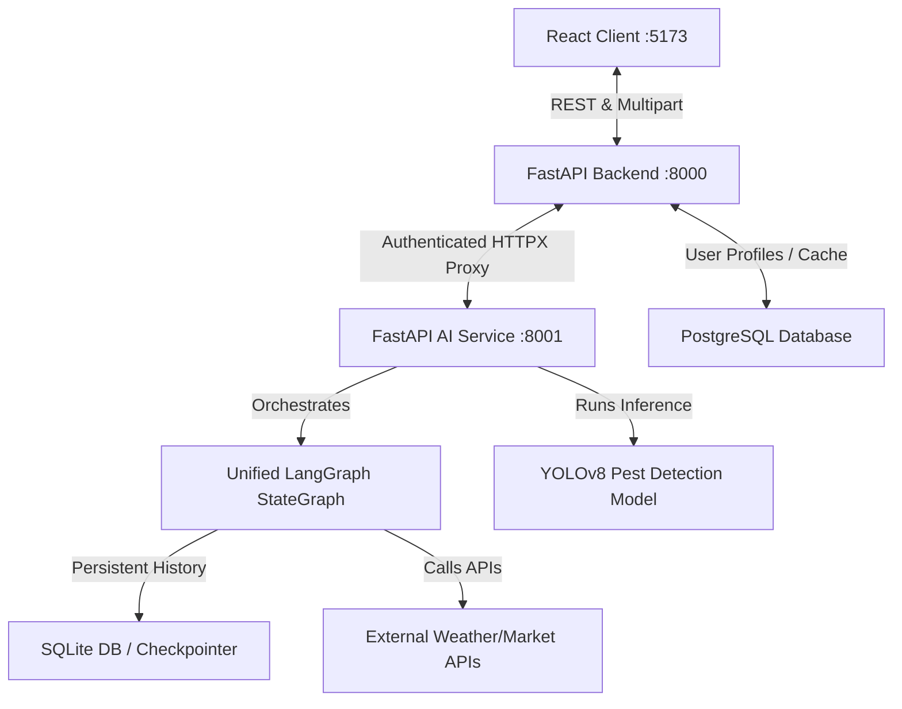

# FasalSaathi System Architecture

FasalSaathi is a premium, unified agricultural advisory platform designed to assist Indian farmers with real-time pest detection, personalized crop recommendations, eligibility-based government scheme matching, and agricultural intelligence.

This document describes the high-level system architecture, component topology, and individual service roles.

---

## System Overview

FasalSaathi is built as a multi-tier monorepo consisting of:
1. **Frontend (:5173)**: React 19 + Vite client with Zustand global state management and Tailwind CSS.
2. **Backend API Gateway (:8000)**: FastAPI application providing secure authentication, user management, and JWT-authenticated reverse proxying.
3. **AI Service (:8001)**: FastAPI engine running a single unified LangGraph orchestrator and YOLOv8-based plant pathology computer vision models.

### Monorepo Topology

---

## Tier Roles & Responsibilities

### 1. Frontend Client
- **Tech Stack**: React 19, Zustand (persisted stores), Tailwind CSS v4, Lucide Icons, Recharts.
- **Role**: Provides a highly responsive, premium dashboard. It manages multi-turn chat sessions with LangGraph, renders pest detection overlays (bounding boxes with severity tags), and captures farmer profiles.
- **Authentication**: Stores JWT tokens and handles seamless redirection to onboarding/login.

### 2. Backend API Gateway
- **Tech Stack**: FastAPI, SQLAlchemy (PostgreSQL ORM), JWT, HTTPX.
- **Role**: Serves as the central API gateway and single point of entry for the frontend. It manages user authentication, stores persistent field/user profiles in PostgreSQL, and proxies AI-related chat and analysis queries to the AI Service.
- **Profile Enrichment**: Automatically extracts the user's profile context (location, soil health, crop preferences) from PostgreSQL and injects it into all outbound requests directed to the AI Service.

### 3. AI Service
- **Tech Stack**: FastAPI, LangGraph, LangChain, Google Generative AI (Gemini 2.5 Flash), Ultralytics YOLOv8.
- **Role**: Serves as the core reasoning engine. It compiles the unified LangGraph orchestrator, manages dynamic tool execution, and performs custom YOLOv8 pest classification.
- **Image Lifecycle**: Integrates an image storage manager to process crop scans, verify bounding boxes, and execute background file expirations.

---

## Core AI Architecture

The system transitions from legacy standalone agents to a **Unified LangGraph Orchestration model**.

### 1. Unified State Graph
Instead of isolated chat and pipeline routes, a single compiled state machine manages all farmer interactions. It handles greetings, general questions, follow-ups, and complex diagnostic analysis (e.g., "What crop should I grow?").

### 2. Specialized Agent Nodes
- **Crop Recommendation Agent**: Employs agronomist prompt templates and LLM classification to suggest crop choices based on location, soil, and season. Integrates hardcoded fallback sets if APIs or LLMs time out.
- **Scheme Recommendation Agent**: Compares user details against 25+ government schemes. It filters by age, gender, and income constraints, ranks eligibility with LLM support, and maps schemes to metadata.
- **Pest Detection Node**: Runs YOLOv8 models in background threads, outputs detected bounding boxes, matches results to severe/mild categories, and returns treatment solutions.
- **Conversational Node**: An interactive LLM assistant capable of calling real-time weather and mandi price tools to satisfy generic queries.

### 3. Validation and Fallbacks
The system includes a **Scored Validation Layer** that validates plans before execution using a prioritized scoring formula:
$$\text{Score} = 0.45 \times \text{Relevance} + 0.30 \times \text{Dependency} + 0.10 \times \text{Planner Confidence} + 0.15 \times \text{Tool Availability}$$

Plans scoring below `0.4` automatically fall back to conversational assistance.

---

## Code References
- Main entry point: [main.py](file:///e:/Desktop/Web%20Development/FasalSaathi/ai_service/main.py)
- Graph definition: [orchestrator.py](file:///e:/Desktop/Web%20Development/FasalSaathi/ai_service/app/graph/orchestrator.py)
- Backend gateway entry: [main.py](file:///e:/Desktop/Web%20Development/FasalSaathi/backend/main.py)
