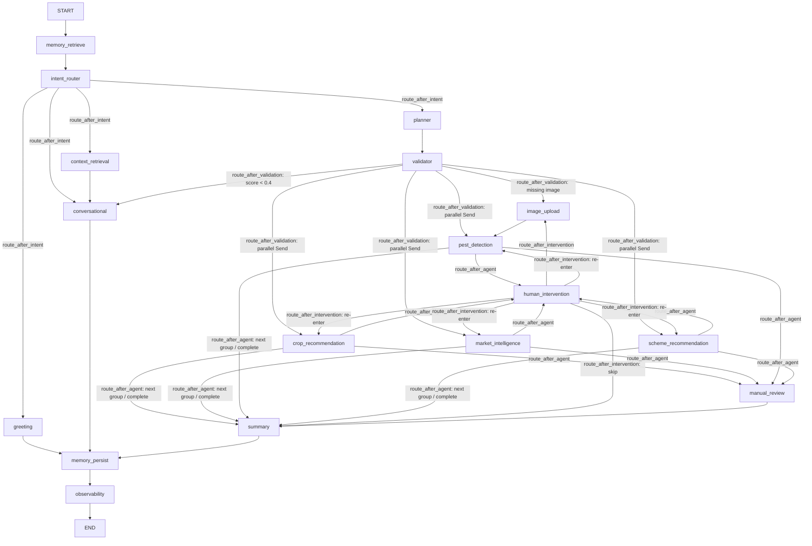

# Unified LangGraph Flow Design

This document details the topology, routing logic, execution groups, and control mechanisms of FasalSaathi's unified LangGraph orchestrator.

---

## Graph Topology

The FasalSaathi orchestrator runs a single compiled `StateGraph` which guides the conversation through retrieval, planning, validation, execution, summary, and observability.

---

## Graph State Schema (`FasalSaathiState`)

The state is represented by the [FasalSaathiState](file:///e:/Desktop/Web%20Development/FasalSaathi/ai_service/app/graph/state.py) class, which acts as the shared database for the entire graph transaction.

| Field | Type | Reducer | Purpose |
|---|---|---|---|
| `messages` | `list[AnyMessage]` | `add_messages` | Full history of chat messages |
| `intent` | `str` | Keep Last | Intent classification: greeting, workflow, conversational, etc. |
| `sub_intents` | `list[str]` | Keep Last | Detailed agent tasks requested (crop, market, pest, scheme) |
| `farmer_profile` | `dict` | Keep Last | Farmer demographic profile (state, land size, crops grown) |
| `planner_output` | `PlannerOutput` | Keep Last | Plan proposed by LLM planner |
| `validation_result` | `dict` | Keep Last | Output of the validation node (score, execution groups, warnings) |
| `crop_recommendations` | `list[dict]` | `operator.add` | Cumulative crop recommendation results |
| `market_intelligence` | `list[dict]` | `operator.add` | Mandi prices, trend analyses, and weather risks |
| `scheme_recommendations` | `list[dict]` | `operator.add` | Matches to eligibility-based government schemes |
| `pest_detection_result` | `dict` | `_merge_dicts` | Results of YOLOv8 pest detection and treatments |
| `confidence_scores` | `dict[str, float]` | `_merge_dicts` | Confidence level of each executing agent |
| `uploaded_image_id` | `str` | Keep Last | Unique ID of uploaded crop scan image |
| `image_metadata` | `dict` | Keep Last | Metadata of uploaded crop scan (timestamp, dimensions) |
| `intervention_attempts` | `dict[str, int]` | `_merge_dicts` | Counter tracking retry attempts per agent |
| `graph_path` | `list[str]` | `operator.add` | Trace of visited nodes for debugging and analytics |
| `state_schema_version` | `str` | Keep Last | Versioning token to support backward-compatibility |

---

## Dynamic Routing Functions

Routing is managed strictly by conditional edges to guarantee a clean graph topology:

### 1. `route_after_intent`
Classifies input into four pipelines:
- **`greeting`**: Static friendly replies.
- **`workflow`**: Multi-agent diagnostic flow.
- **`follow_up`**: References past recommendations.
- **`conversational`**: Direct chit-chat.

### 2. `route_after_validation`
Controls plan initialization:
- Routes to `conversational` if validation score is $<0.4$.
- Routes to `image_upload` if a pest scan is planned but no `uploaded_image_id` is present.
- Dispatches planned agents from the first execution group using `Send()` parallel commands.

### 3. `route_after_agent`
Runs upon agent execution completion:
- **Confidence Gate**: If agent confidence is below its threshold (e.g. $0.5$ for pest/crop), triggers `human_intervention`.
- **Parallel Dispatch**: Spawns the next group in parallel if available.
- **Summary Transition**: Cascades to `summary` when all tasks finish.

### 4. `route_after_intervention`
Handles human intervention results:
- Routes to `image_upload` if an image is needed.
- Re-enters the failing agent node for a second try.
- Cascades to `summary` if retry limit is exhausted.

---

## Loop Prevention & Reliability

To prevent infinite loops during low-confidence states, FasalSaathi implements two robust check systems:

1. **Attempt Counters**: The graph state tracks retry attempts inside `intervention_attempts`. If an agent fails confidence gates, it is allowed up to $2$ retries (`MAX_INTERVENTION_ATTEMPTS = 2`).
2. **Manual Review Handoff**: If an agent fails to exceed its confidence threshold after the second attempt, routing bypasses further intervention. The state is directed to the `manual_review` node, which appends an administrative disclaimer warning the user that automated confidence is low, and then routes directly to `summary`.

---

## Code References
- Router implementation: [routing.py](file:///e:/Desktop/Web%20Development/FasalSaathi/ai_service/app/graph/routing.py)
- Main Graph Assembly: [orchestrator.py](file:///e:/Desktop/Web%20Development/FasalSaathi/ai_service/app/graph/orchestrator.py)
- Scored Validation: [validator.py](file:///e:/Desktop/Web%20Development/FasalSaathi/ai_service/app/graph/validator.py)
